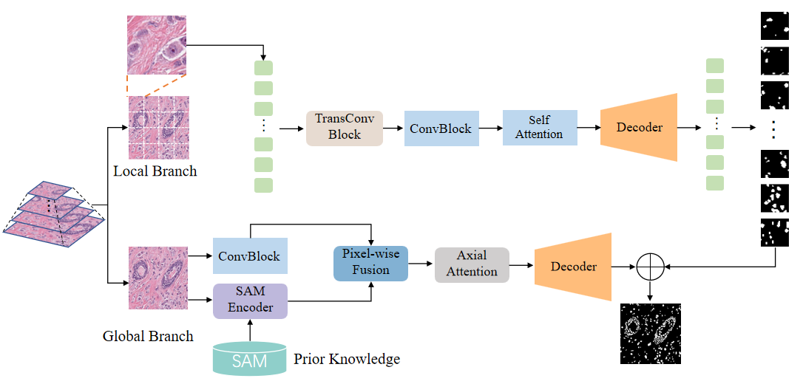

# Bi-BPT

This is an official implementation of the paper "Integrating Prior Knowledge into a Bibranch Pyramid Network for Medical Image Segmentation"

## Introduction

Medical image segmentation is crucial for obtaining accurate diagnoses, 
and while convolutional neural network (CNN)-based methods have made strides in recent years, 
they struggle with modeling long-range dependencies. Transformer-based methods improve this task but require more computational resources. 
The segment anything model (SAM) can generate pixel-level segmentation results for natural images using sparse manual prompts, 
but it performs poorly on low-contrast, noisy ultrasound images. To address this issue, we propose a new medical image segmentation network architecture that 
integrates transformer components, CNN modules, and an SAM encoder into a unified framework. This allows us to simultaneously capture both long-range dependencies 
and local features. Additionally, we incorporate the image features extracted from the SAM model as prior knowledge to achieve further improved segmentation accuracy 
with limited training data. To reduce the imposed computational stress, we employ an axial attention mechanism to approximate a transformer's effects by expanding the 
receptive field. Instead of replacing the transformer components with lightweight attention modules, our model is divided into a global branch and a local branch. 
The global branch extracts context features with the transformer components, while the local branch processes patch tokens with the axial attention mechanism. 
We also construct an image pyramid to excavate internal statistics and multiscale representations to obtain more accurate segmentation regions. 
This bibranch pyramid transformer (Bi-BPT) architecture is effective and robust for medical image segmentation, surpassing other related segmentation network architectures. The experimental results obtained on various medical image datasets demonstrate its effectiveness.
<p align="center">
  
</p>

### Using the code:

- Clone this repository:
```bash
git clone https://github.com/
cd Bibpt
```

The code is stable using Python 3.8.16, Pytorch 1.7.0

To install all the dependencies using conda:

```bash
conda env create -f environment.yml
conda activate bi_bpt
```

To install all the dependencies using pip:

```bash
pip install -r requirements.txt
```

### Links for downloading the public Datasets:

1) MoNuSeG Dataset - <a href="https://monuseg.grand-challenge.org/Data/"> Link (Original)</a> 
2) GLAS Dataset - <a href="https://warwick.ac.uk/fac/sci/dcs/research/tia/glascontest/"> Link (Original) </a> 
3) Covid19 Dataset -<a href="https://www.sciencedirect.com/science/article/pii/S001048252100113X"> Link (Original) </a>
4) MSD Dataset -<a href="https://www.nature.com/articles/s41467-022-30695-9"> Link (Original) </a>


## Using the Code for your dataset

### Dataset Preparation

Prepare the dataset in the following format for easy use of the code. The train and test folders should contain two subfolders each: img and label. Make sure the images their corresponding segmentation masks are placed under these folders and have the same name for easy correspondance. Please change the data loaders to your need if you prefer not preparing the dataset in this format.


```bash
Train Folder-----
      img----
          0001.png
          0002.png
          .......
      labelcol---
          0001.png
          0002.png
          .......
Validation Folder-----
      img----
          0001.png
          0002.png
          .......
      labelcol---
          0001.png
          0002.png
          .......
Test_Folder Folder-----
      img----
          0001.png
          0002.png
          .......
      labelcol---
          0001.png
          0002.png
          .......

```

- The ground truth images should have pixels corresponding to the labels. Example: In case of binary segmentation, the pixels in the GT should be 0 or 255.

### Training Command:

```bash 
python train.py --train_dataset "enter train directory" --val_dataset "enter validation directory" --direc 'path for results to be saved' --batch_size 4 --epoch 400 --save_freq 10 --learning_rate 0.001
```

### Testing Command:

```bash 
python test.py --loaddirec "./saved_model_path/model_name.pth" --val_dataset "test dataset directory" --direc 'path for results to be saved' --batch_size 1 
```

The results including predicted segmentations maps will be placed in the results folder along with the model weights. Run the performance metrics code in MATLAB for calculating F1 Score and mIoU. 


### Acknowledgement:

The dataloader code is inspired from <a href="https://github.com/jeya-maria-jose/Medical-Transformer?tab=readme-ov-file"> pytorch-UNet </a>. The axial attention code is developed from <a href="https://github.com/csrhddlam/axial-deeplab">axial-deeplab</a>. 

# Citation:

```bash
@article{HAN2024104945,
title = {Integrating prior knowledge into a bibranch pyramid network for medical image segmentation},
journal = {Image and Vision Computing},
volume = {143},
pages = {104945},
year = {2024},
issn = {0262-8856},
doi = {https://doi.org/10.1016/j.imavis.2024.104945},
url = {https://www.sciencedirect.com/science/article/pii/S0262885624000489},
author = {Xianjun Han and Tiantian Li and Can Bai and Hongyu Yang},
keywords = {Image pyramid, Medical image segmentation, Prior knowledge, Medical image processing},
abstract = {Medical image segmentation is crucial for obtaining accurate diagnoses, and while convolutional neural network (CNN)-based methods have made strides in recent years, they struggle with modeling long-range dependencies. Transformer-based methods improve this task but require more computational resources. The segment anything model (SAM) can generate pixel-level segmentation results for natural images using sparse manual prompts, but it performs poorly on low-contrast, noisy ultrasound images. To address this issue, we propose a new medical image segmentation network architecture that integrates transformer components, CNN modules, and an SAM encoder into a unified framework. This allows us to simultaneously capture both long-range dependencies and local features. Additionally, we incorporate the image features extracted from the SAM model as prior knowledge to achieve further improved segmentation accuracy with limited training data. To reduce the imposed computational stress, we employ an axial attention mechanism to approximate a transformer's effects by expanding the receptive field. Instead of replacing the transformer components with lightweight attention modules, our model is divided into a global branch and a local branch. The global branch extracts context features with the transformer components, while the local branch processes patch tokens with the axial attention mechanism. We also construct an image pyramid to excavate internal statistics and multiscale representations to obtain more accurate segmentation regions. This bibranch pyramid transformer (Bi-BPT) architecture is effective and robust for medical image segmentation, surpassing other related segmentation network architectures. The experimental results obtained on various medical image datasets demonstrate its effectiveness.}
}
```

Open an issue or mail me directly in case of any queries or suggestions. 
